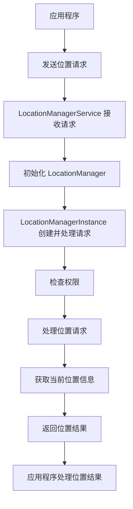
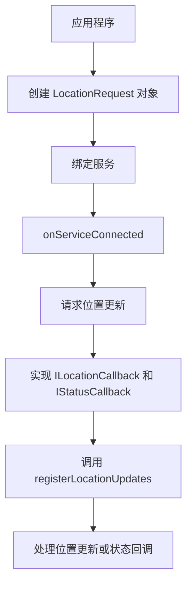

# GmsCore——location模块文档

## 模块main目录结构

```tex
main
│   AndroidManifest.xml
│
├─kotlin
│   └─org
│       └─microg
│           └─gms
│               └─location
│                   ├─manager
│                   │   ├─AbstractLocationManagerInstance.kt // 抽象类，提供位置管理实例的基础实现
│                   │   ├─AskPermissionActivity.kt // 活动类，处理权限请求
│                   │   ├─DeviceOrientationManager.kt // 管理设备方向传感器数据和回调
│                   │   ├─extensions.kt // 扩展函数，用于增强原有类的功能
│                   │   ├─LastLocationCapsule.kt // 存储和管理设备的最后已知位置
│                   │   ├─LocationAppsDatabase.kt // SQLite数据库类，存储应用使用位置服务的数据
│                   │   ├─LocationManager.kt // 位置管理核心类，处理位置服务的注册和更新
│                   │   ├─LocationManagerInstance.kt // 具体的LocationManager实现，管理位置更新请求
│                   │   ├─LocationManagerService.kt // 提供位置服务的服务类
│                   │   ├─LocationPostProcessor.kt // 处理和调整位置数据的类
│                   │   └─LocationRequestManager.kt // 管理位置请求，处理位置更新和回调
│                   │
│                   ├─reporting
│                   │   ├─extensions.kt // 扩展函数，用于增强原有类的功能
│                   │   ├─ReportingAndroidService.kt // Android服务类，用于处理位置报告
│                   │   └─ReportingServiceInstance.kt // 具体的报告服务实现
│                   │
│                   ├─settings
│                   │   ├─DetailedLocationSettingsStates.kt // 获取和存储详细位置设置状态的类
│                   │   └─LocationSettingsCheckerActivity.kt // 活动类，用于检查和请求位置设置
│                   │
│                   └─ui
│                       ├─extensions.kt // 扩展函数，用于增强原有类的功能
│                       ├─LocationAllAppsFragment.kt // 界面片段，显示所有应用的位置设置
│                       ├─LocationAppFragment.kt // 界面片段，显示单个应用的位置设置
│                       ├─LocationMapPreference.kt // 自定义偏好设置控件，显示位置地图
│                       └─LocationPreferencesFragment.kt // 界面片段，显示位置服务的偏好设置
│
└─res......
```

### GmsCore 获取用户当前位置的服务处理流程

#### 流程概述

1. **权限申请**：应用需要获取位置相关的权限。
2. **初始化位置管理服务**：创建和初始化相关的管理类。
3. **请求位置信息**：通过 `LocationManagerInstance` 获取当前位置信息。
4. **处理位置结果**：处理返回的位置信息并进行相应的逻辑处理。

#### 服务处理流程图



1. **应用程序**：应用程序发起位置请求。
2. **发送位置请求**：应用程序通过绑定 `LocationManagerService` 发送位置请求。
3. **LocationManagerService 接收请求**：`LocationManagerService` 接收到应用程序的请求。
4. **初始化 LocationManager**：在 `LocationManagerService` 中初始化 `LocationManager`。
5. **LocationManagerInstance 创建并处理请求**：`LocationManagerInstance` 被创建并开始处理位置请求。
6. **检查权限**：`LocationManagerInstance` 检查应用程序是否具有访问位置信息的权限。
7. **处理位置请求**：在确认权限后，`LocationManagerInstance` 开始处理具体的位置请求。
8. **获取当前位置信息**：`LocationManagerInstance` 获取当前的位置信息。
9. **返回位置结果**：获取到位置信息后，将结果返回给 `LocationManagerService`。
10. **应用程序处理位置结果**：`LocationManagerService` 将位置信息返回给应用程序，应用程序处理返回的位置信息。

### 调用接口所需数据和返回数据

#### 调用接口所需数据

- **LocationRequest**：定义位置请求参数，如更新频率、优先级等。
- **ILocationCallback**：用于接收位置更新。
- **IStatusCallback**：用于接收状态更新。

#### 返回数据

- **LocationResult**：包含位置信息的数据对象。
- **Status**：表示位置请求的状态。

### 主要接口

- **LocationServices**：用于获取位置服务客户端。
- **FusedLocationProviderClient**：用于访问融合的位置提供者。
- **SettingsClient**：用于访问位置设置。
- **GeofencingClient**：用于地理围栏相关操作。

### registerLocationUpdates 方法

该方法在 `LocationManagerInstance` 类中负责注册位置更新请求。它根据不同的参数类型（`IBinder` 或 `PendingIntent`）重载了两个版本。

#### 方法定义

```kotlin
override fun registerLocationUpdates(
    oldBinder: IBinder?,
    binder: IBinder,
    callback: ILocationCallback,
    request: LocationRequest,
    statusCallback: IStatusCallback
)
```

#### 参数

- `oldBinder`: 旧的 `IBinder` 实例，用于更新现有请求。如果为 `null`，表示这是一个新的请求。
- `binder`: 新的 `IBinder` 实例，表示当前请求。
- `callback`: `ILocationCallback` 实例，用于接收位置更新。
- `request`: `LocationRequest` 实例，包含位置请求的详细参数。
- `statusCallback`: `IStatusCallback` 实例，用于返回请求的状态。

#### 方法逻辑

1. **日志记录**:

   - 记录调试日志，显示调用此方法的应用包名。

   ```kotlin
   Log.d(TAG, "registerLocationUpdates (callback) by ${getClientIdentity().packageName}")
   ```

2. **权限检查**:

   -

 检查调用者是否具有任何形式的位置权限。

   ```kotlin
checkHasAnyLocationPermission()
   ```

3. **获取客户端身份**:

   - 获取调用者身份。

   ```kotlin
   val clientIdentity = getClientIdentity()
   ```

4. **启动协程**:

   - 在组件的生命周期内启动协程处理请求。

   ```kotlin
   lifecycleScope.launchWhenStarted {
       try {
           if (oldBinder != null) {
               // 更新现有请求
               locationManager.updateBinderRequest(clientIdentity, oldBinder, binder, callback, request)
           } else {
               // 添加新请求
               locationManager.addBinderRequest(clientIdentity, binder, callback, request)
           }
           // 返回成功状态
           statusCallback.onResult(Status.SUCCESS)
       } catch (e: Exception) {
           // 返回错误状态
           try {
               statusCallback.onResult(Status(CommonStatusCodes.ERROR, e.message))
           } catch (e2: Exception) {
               Log.w(TAG, "Failed", e)
           }
       }
   }
   ```

### registerLocationUpdates 方法（重载）

该方法的另一个版本用于处理 `PendingIntent` 类型的请求。

#### 方法定义

```kotlin
override fun registerLocationUpdates(
    pendingIntent: PendingIntent,
    request: LocationRequest,
    statusCallback: IStatusCallback
)
```

#### 参数

- `pendingIntent`: `PendingIntent` 实例，用于发送位置更新。
- `request`: `LocationRequest` 实例，包含位置请求的详细参数。
- `statusCallback`: `IStatusCallback` 实例，用于返回请求的状态。

#### 方法逻辑

1. **日志记录**:

   - 记录调试日志，显示调用此方法的应用包名。

   ```kotlin
   Log.d(TAG, "registerLocationUpdates (intent) by ${getClientIdentity().packageName}")
   ```

2. **权限检查**:

   - 检查调用者是否具有任何形式的位置权限。

   ```kotlin
   checkHasAnyLocationPermission()
   ```

3. **获取客户端身份**:

   - 获取调用者身份。

   ```kotlin
   val clientIdentity = getClientIdentity()
   ```

4. **启动协程**:

   - 在组件的生命周期内启动协程处理请求。

   ```kotlin
   lifecycleScope.launchWhenStarted {
       try {
           locationManager.addIntentRequest(clientIdentity, pendingIntent, request)
           statusCallback.onResult(Status.SUCCESS)
       } catch (e: Exception) {
           try {
               statusCallback.onResult(Status(CommonStatusCodes.ERROR, e.message))
           } catch (e2: Exception) {
               Log.w(TAG, "Failed", e)
           }
       }
   }
   ```

### 总结

`registerLocationUpdates` 方法处理位置更新请求，并将其注册到 `LocationManager`。根据不同的参数类型（`IBinder` 或 `PendingIntent`），它提供了两个版本的方法。通过使用协程和生命周期范围来处理异步任务，它确保了在组件活跃时执行请求处理。


## LocationManager（位置管理器实例初始化）

```mermaid
graph TD;
    A[LocationManager] -->|start| B[启动位置管理器]
    B --> C[启动 lastLocationCapsule]
    B --> D[启动 requestManager]
    B --> E[启动 deviceOrientationManager]
    B --> F[初始化 coarsePendingIntent]

    A -->|stop| G[停止位置管理器]
    G --> H[停止 requestManager]
    G --> I[停止 lastLocationCapsule]
    G --> J[停止 deviceOrientationManager]
    G --> K[解除网络和GPS位置监听]

    A -->|addBinderRequest| L[添加 Binder 请求]
    L --> M[验证请求]
    M --> N[确保权限]
    N --> O[添加请求到 requestManager]

    A -->|updateBinderRequest| P[更新 Binder 请求]
    P --> Q[验证请求]
    Q --> R[更新请求到 requestManager]

    A -->|removeBinderRequest| S[移除 Binder 请求]
    S --> T[从 requestManager 移除请求]

    A -->|addIntentRequest| U[添加 Intent 请求]
    U --> V[验证请求]
    V --> W[确保权限]
    W --> X[添加请求到 requestManager]

    A -->|removeIntentRequest| Y[移除 Intent 请求]
    Y --> Z[从 requestManager 移除请求]

    A -->|getLastLocation| AA[获取最后位置]
    AA --> AB[验证请求]
    AB --> AC[检查权限]
    AC --> AD[获取最后位置数据]
    AD --> AE[处理并返回位置数据]

    A -->|getLocationAvailability| AF[获取位置可用性]
    AF --> AG[验证请求]
    AG --> AH[返回位置可用性数据]

    A -->|updateNetworkLocation| AI[更新网络位置]
    AI --> AJ[获取最后位置数据]
    AJ --> AK[更新 lastLocationCapsule]
    AK --> AL[发送新位置]

    A -->|updateGpsLocation| AM[更新GPS位置]
    AM --> AN[更新 lastLocationCapsule]
    AN --> AL

    A -->|sendNewLocation| AO[发送新位置]
    AO --> AP[处理最新位置数据]
    AP --> AQ[通知 deviceOrientationManager 更新位置]

    A -->|ensurePermissions| AR[确保权限]
    AR --> AS[检查权限]
    AS --> AT[请求权限]

    A -->|dump| AU[输出调试信息]
    AU --> AV[打印位置可用性信息]
    AU --> AW[打印最后位置数据]
    AU --> AX[打印网络位置服务信息]
    AU --> AY[输出 requestManager 信息]
    AU --> AZ[输出 deviceOrientationManager 信息]

    A -->|handleCacheIntent| BA[处理缓存 Intent]
    BA --> BB[根据 Intent 类型处理请求]

```



这个流程图展示了 `LocationManager` 类中主要方法的调用和处理逻辑，包括启动和停止位置管理器、添加和移除位置请求、获取位置信息和权限处理等。


## 接口示例

### 1、访问位置服务的接口，提供与位置相关的 API

```kotlin
import com.google.android.gms.location.LocationServices
val fusedLocationClient = LocationServices.getFusedLocationProviderClient(context)
```

**[位置信息权限_demo](https://github.com/youchuang1/platform-samples/tree/main/samples/location/src/main/java/com/example/platform/location/permission)**

### 2、检测用户活动（如步行、骑车、驾车）的接口

```kotlin
import com.google.android.gms.location.ActivityRecognition
val activityRecognitionClient = ActivityRecognition.getClient(context)
```

**[用户运动状态识别_demo](https://github.com/youchuang1/platform-samples/tree/main/samples/location/src/main/java/com/example/platform/location/useractivityrecog)**

### 3、管理地理围栏（Geofence）的接口

```kotlin
import com.google.android.gms.location.GeofencingClient
import com.google.android.gms.location.Geofence
import com.google.android.gms.location.GeofencingRequest

val geofencingClient = LocationServices.getGeofencingClient(context)

val geofence = Geofence.Builder()
    .setRequestId("example_geofence")
    .setCircularRegion(latitude, longitude, radius)
    .setExpirationDuration(Geofence.NEVER_EXPIRE)
    .setTransitionTypes(Geofence.GEOFENCE_TRANSITION_ENTER or Geofence.GEOFENCE_TRANSITION_EXIT)
    .build()

val geofencingRequest = GeofencingRequest.Builder()
    .setInitialTrigger(GeofencingRequest.INITIAL_TRIGGER_ENTER)
    .addGeofence(geofence)
    .build()
```

**[创建和监控地理围栏_demo](https://github.com/youchuang1/platform-samples/tree/main/samples/location/src/main/java/com/example/platform/location/geofencing)**

### 服务处理流程

#### 应用程序调用流程

1. **创建 `LocationRequest` 对象**:

   - 应用程序首先需要创建一个 `LocationRequest` 对象，用于定义位置更新的请求参数。可以使用 `LocationRequest.Builder` 来构建请求。

   ```kotlin
   val locationRequest = LocationRequest.Builder(Priority.PRIORITY_HIGH_ACCURACY, 5000)
       .setMinUpdateIntervalMillis(2000)
       .setMaxUpdateDelayMillis(10000)
       .build()
   ```

2. **绑定服务**:

   - 应用程序需要绑定到提供位置服务的服务。例如，通过 `ServiceConnection` 来绑定服务。

   ```kotlin
   val serviceConnection = object : ServiceConnection {
       override fun onServiceConnected(name: ComponentName?, service: IBinder?) {
           val binder = service as LocationService.LocalBinder
           locationManagerInstance = binder.getService()
           requestLocationUpdates()
       }
   
       override fun onServiceDisconnected(name: ComponentName?) {
           locationManagerInstance = null
       }
   }
   
   Intent(this, LocationService::class.java).also { intent ->
       bindService(intent, serviceConnection, Context.BIND_AUTO_CREATE)
   }
   ```

3. **请求位置更新**:

   - 绑定服务成功后，可以通过调用 `LocationManagerInstance` 的 `registerLocationUpdates` 方法来请求位置更新。

   ```kotlin
   fun requestLocationUpdates() {
       if (locationManagerInstance != null) {
           val callback = object : ILocationCallback.Stub() {
               override fun onLocationResult(result: LocationResult?) {
                   result?.let {
                       for (location in it.locations) {
                           // 处理位置更新
                           Log.d("LocationUpdates", "Location: ${location.latitude}, ${location.longitude}")
                       }
                   }
               }
   
               override fun onLocationAvailability(availability: LocationAvailability?) {
                   // 处理位置可用性变化
               }
           }
   
           val statusCallback = object : IStatusCallback.Stub() {
               override fun onResult(status: Status) {
                   if (status.isSuccess) {
                       Log.d("LocationUpdates", "Location updates registered successfully")
                   } else {
                       Log.d("LocationUpdates", "Failed to register location updates: ${status.statusMessage}")
                   }
               }
           }
   
           try {
               locationManagerInstance?.registerLocationUpdates(null, Binder(), callback, locationRequest, statusCallback)
           } catch (e: RemoteException) {
               e.printStackTrace()
           }
       }
   }
   ```

#### 流程图



#### 详细步骤说明

1. **创建 `LocationRequest` 对象**:
   - 使用 `LocationRequest.Builder` 创建一个 `LocationRequest` 对象，设置请求的优先级、更新间隔、最小更新间隔和最大延迟等参数。

2. **绑定服务**:
   - 通过 `ServiceConnection` 绑定到提供位置服务的服务。在 `onServiceConnected` 回调中获取 `LocationManagerInstance` 实例，并调用 `requestLocationUpdates` 方法来请求位置更新。

3. **实现回调接口**:
   - 实现 `ILocationCallback` 和 `IStatusCallback` 接口，处理位置更新和状态回调。

4. **请求位置更新**:
   - 使用 `LocationManagerInstance` 的 `registerLocationUpdates` 方法注册位置更新请求。如果有旧的 `IBinder`，则更新现有请求；否则，添加新的请求。

5. **处理位置更新和状态回调**:
   - 在 `ILocationCallback` 中处理位置更新。在 `IStatusCallback` 中处理请求状态。